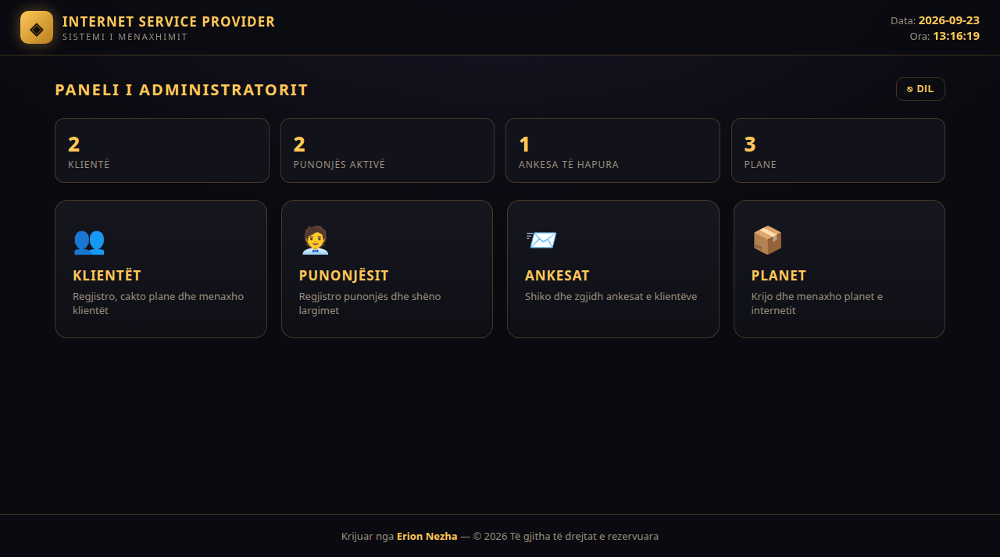

# 🌐 Ofruesi i Shërbimit të Internetit 🇦🇱

Created by **Erion Nezha**

> Sistem menaxhimi desktop Java Swing për një ofrues shërbimi interneti — regjistrime klientësh dhe punonjësish, krijim planesh interneti, ndjekje ankesash dhe panel administratori, të gjitha të mbështetura nga MySQL.



**🔴 Demo live:** https://erionnezha.github.io/Internet-Service-Provider/


## ✨ Modulet

| File | Dritarja | Përshkrimi |
|------|--------|-------------|
| `Home.java` | Faqja Kryesore | Portali i hyrjes dhe paneli kryesor me orë dhe datë live — pika e hyrjes së aplikacionit |
| `Admin.java` | Paneli i Administratorit | Hapësira e punës së administratorit me kontrolle të privilegjuara të sistemit |
| `Customer.java` | Klienti | Regjistrimi i klientëve dhe menaxhimi i plotë i regjistrimeve |
| `Employee.java` | Punonjësi | Menaxhimi i regjistrimeve të punonjësve të ISP-së |
| `CreatePlan.java` | Krijo Plan | Përcakto planet e internetit — emrat, shpejtësitë dhe çmimet |
| `Complaint.java` | Zyra e Ankesave | Paraqit dhe ndiq ankesat e klientëve |
| `javaconnect.java` | — | Ndihmësi i lidhjes MySQL që lidh çdo ekran me databazën `isp` |

## 🛠️ Teknologjitë

- **Java** (Swing / AWT) — UI desktop
- **JDBC** — lidhja me databazën
- **MySQL** — databaza `isp`

## ▶️ Si ekzekutohet

1. Krijo një databazë MySQL me emrin `isp` dhe përditëso kredencialet në `javaconnect.java`.
2. Kompilo të gjitha burimet:
   ```bash
   javac *.java
   ```
3. Nise aplikacionin:
   ```bash
   java Home
   ```

## 🖥️ Demo

Shfleto kodin burimor të plotë të çdo moduli me theksim sintakse në demo-n live më sipër — pa pasur nevojë për IDE.

## 📄 Licenca

Copyright © 2026 Erion Nezha. Të gjitha të drejtat e rezervuara. Shih [LICENSE](LICENSE).

---

# 🌐 Internet Service Provider 🇬🇧

Created by **Erion Nezha**

> A Java Swing desktop management system for an Internet Service Provider — customer & employee records, internet plan creation, complaint tracking and an admin panel, all backed by MySQL.

**🔴 Live demo:** https://erionnezha.github.io/Internet-Service-Provider/


## ✨ Modules

| File | Window | Description |
|------|--------|-------------|
| `Home.java` | Home Page | Login portal & main dashboard with live clock and date — the application entry point |
| `Admin.java` | Admin Panel | Administrator workspace with privileged system controls |
| `Customer.java` | Customer | Customer registration and full record management |
| `Employee.java` | Employee | Employee record management for ISP staff |
| `CreatePlan.java` | Create Plan | Define internet plans — names, speeds and pricing |
| `Complaint.java` | Complaint Desk | File and track customer complaints |
| `javaconnect.java` | — | MySQL connection helper wiring every screen to the `isp` database |

## 🛠️ Tech Stack

- **Java** (Swing / AWT) — desktop UI
- **JDBC** — database connectivity
- **MySQL** — `isp` database

## ▶️ How to Run

1. Create a MySQL database named `isp` and update the credentials in `javaconnect.java`.
2. Compile all sources:
   ```bash
   javac *.java
   ```
3. Launch the application:
   ```bash
   java Home
   ```

## 🖥️ Demo

Browse every module's full source code with syntax highlighting in the live demo above — no IDE required.

## 📄 License

Copyright © 2026 Erion Nezha. All rights reserved. See [LICENSE](LICENSE).
